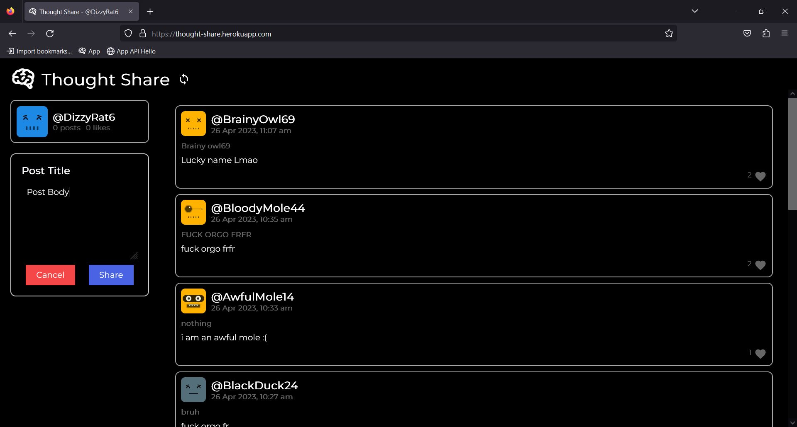

# Thought Share

## Create a post

### Press "Share Something With The World"

### Add a Title and Body to your thought

### Share It

## Delete

### Delete a post by hovering over it and selecting delete

### The post gets deleted

## Like A Post

### Like and Unlike a post by pressing the like button

